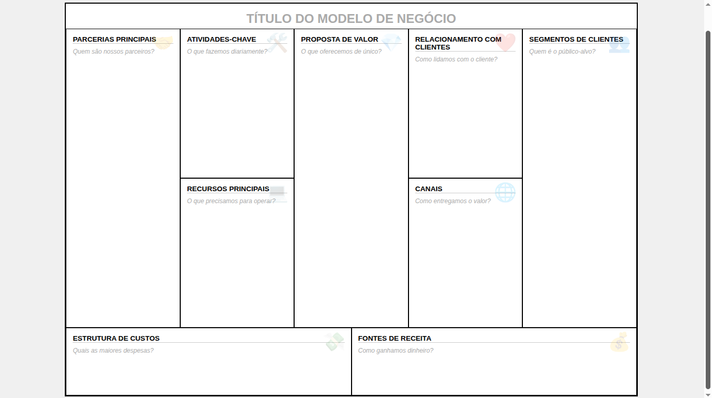

# 📊 Business Model Canvas Interativo

Uma ferramenta web leve, intuitiva e funcional para criação de **Business Model Canvas (BMC)**. Com este projeto, você pode preencher o seu modelo de negócio diretamente no navegador, salvar o progresso em arquivos JSON e exportar o resultado final em PDF de alta qualidade.

## ✨ Funcionalidades

* **Edição Direta:** Clique e digite em qualquer quadrante. O sistema organiza automaticamente as entradas em listas de marcadores (bullets).
* **Salvamento Local (JSON):** Exporte seus dados para um arquivo `.json` e continue editando mais tarde sem depender de banco de dados.
* **Exportação em PDF:** Gere um documento pronto para impressão ou apresentação no formato A4 (paisagem).
* **Interface Responsiva:** Grid otimizado que simula o layout original do canvas de Alexander Osterwalder.
* **Guia Visual:** Cada bloco contém emojis e frases de ajuda (*placeholders*) para orientar o preenchimento.

## 🚀 Como usar

1.  **Acesse a Ferramenta:** Abra o arquivo `index.html` em qualquer navegador moderno.
2.  **Preencha o Canvas:** Clique nas áreas em branco para adicionar os pontos-chave do seu negócio.
3.  **Salve seu Trabalho:**
    * Clique em **💾 Salvar JSON** para baixar o arquivo de edição.
    * Para retomar, clique em **📁 Carregar JSON** e selecione o arquivo salvo anteriormente.
4.  **Gere o PDF:** Quando estiver pronto, clique em **📂 PDF** para gerar a versão final para distribuição.

## 🛠️ Tecnologias Utilizadas

* **HTML5/CSS3:** Estruturação e estilização via CSS Grid para o layout do canvas.
* **JavaScript (Vanilla):** Lógica de manipulação do DOM e gerenciamento de arquivos.
* **[html2pdf.js](https://ekoopmans.github.io/html2pdf.js/):** Biblioteca utilizada para converter o conteúdo HTML/CSS em um documento PDF fiel ao design original.

## 📋 Estrutura do Projeto

* `index.html`: Contém toda a estrutura, estilos e lógica da aplicação (Single File Application).

---

## 🎨 Layout do Canvas

O projeto segue a estrutura padrão composta por:
* **Parcerias Principais**
* **Atividades-Chave**
* **Proposta de Valor**
* **Relacionamento com Clientes**
* **Segmentos de Clientes**
* **Recursos Principais**
* **Canais**
* **Estrutura de Custos**
* **Fontes de Receita**
